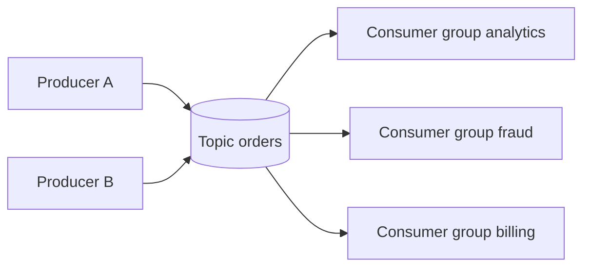

Module 2

Kafka essentials

<h1>Apache Kafka</h1>
<h2>for Real-Time Data Streaming</h2>

  

    
Role

    
Kafka sert a transporter, distribuer et rejouer des evenements a grande echelle.

  

  

    
Promesse

    
Decoupler producteurs et consommateurs sans perdre la logique du flux.

  

---

# 1. Kafka, en une phrase

Kafka est une plateforme d'evenements qui permet d'ecrire des messages dans des <strong>topics</strong> puis de les lire de maniere fiable et scalable.

  

    
Producer

    
L'application qui publie un evenement.

  

  

    
Topic

    
Le canal logique dans lequel les evenements sont ranges.

  

  

    
Consumer

    
Le service qui lit et utilise ces evenements.

  

---

# 2. Architecture de base

  Kafka ne fait pas seulement circuler des donnees. Il permet a plusieurs systemes de consommer le meme flux pour des usages differents.

---

# 3. Topics et partitions

  

    
Topic

    
Le nom logique du flux. Exemple : <strong>orders</strong>, <strong>payments</strong>, <strong>pageviews</strong>.

  

  

    
Partition

    
Le topic est decoupe en morceaux pour paralleliser l'ecriture et la lecture.

  

  
Image mentale

  
Un topic est une bibliotheque. Les partitions sont les rayonnages qui permettent a plusieurs personnes de travailler en meme temps.

---

# 4. Consumer groups et offsets

  

    
Consumer group

    
Plusieurs consommateurs cooperent pour lire un topic en se partageant les partitions.

  

  

    
Offset

    
La position de lecture dans une partition. Il sert a savoir ou reprendre.

  

L'offset est le marque-page du consommateur.

---

# 5. Pourquoi Kafka est central en streaming

  

    
Decouplage

    
Les producteurs n'ont pas besoin de connaitre tous les consommateurs.

  

  

    
Scalabilite

    
Les partitions permettent de monter en charge horizontalement.

  

  

    
Relecture

    
On peut relire l'historique pour recalculer ou reconstruire une vue.

  

---

# 6. Suite du module

  

    
A approfondir ensuite

    
replication, retention, ordering, keys, schema registry, Kafka Connect, Kafka Streams

  

  

    
Question de cours

    
Quand choisir Kafka plutot qu'une base, une queue classique ou un appel API direct ?

  

