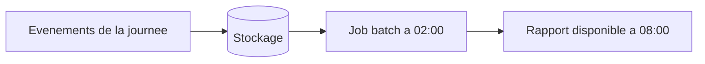
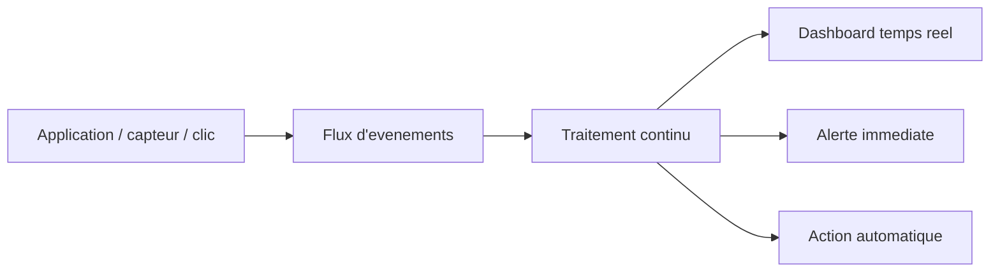
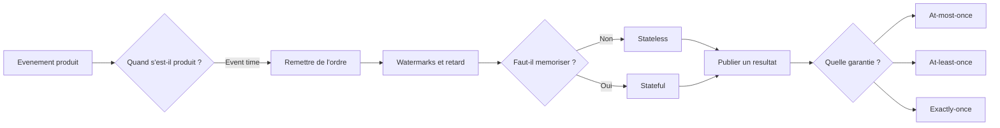

<h1>From Batch to Streaming</h1>

<h2>Foundations of Real-Time Data Processing</h2>

  

    
Question centrale

    
Pourquoi attendre la nuit pour traiter une information qui a de la valeur maintenant ?

  

  

    
Objectif

    
Comprendre les concepts avant de parler d'outils.

  

Batch, streaming, event time, watermarks, state et garanties de livraison.

---
layout: two-cols
layoutClass: gap-10
---

# 1. Le batch, c'est quoi ?

Le **batch processing** traite des donnees **par paquets**.

Points clefs :

- on collecte pendant un certain temps
- on lance un job a heure fixe
- on produit un resultat apres coup

Exemples classiques :

- facturation a la fin de la journee
- reporting quotidien
- consolidation comptable la nuit

::right::

  
Illustration

  

    Analogie : on remplit un camion toute la journee, puis on le fait partir une seule fois.
  

---

# 2. Pourquoi le batch ne suffit plus ?

  

    
1

    
Latence

    
Le systeme reagit trop tard pour les usages temps reel.

  

  

    
2

    
Vision figee

    
Le tableau de bord ressemble a une photo prise plus tot, pas a la situation actuelle.

  

  

    
3

    
Pic de charge

    
On concentre le traitement sur quelques gros jobs plutot que de lisser l'effort.

  

  <strong>Image mentale :</strong> le batch est une photo. Le streaming ressemble davantage a une video en direct.

  

    
Le batch reste excellent pour

    
l'historique, la comptabilite, les recalculs massifs, les pipelines peu urgents.

  

  

    
Il devient limitant pour

    
la fraude, les recommandations, l'IoT, les alertes, la logistique, le suivi applicatif.

  

---

# 3. Le streaming, en une phrase

Traiter les evenements <strong>au fil de l'eau</strong>, des qu'ils arrivent, pour produire une reponse utile rapidement.

  

    
Observer

    
Voir ce qui se passe maintenant.

  

  

    
Decider

    
Declencher une regle ou une alerte.

  

  

    
Agir

    
Mettre a jour un systeme en quasi temps reel.

  

---
layout: two-cols
layoutClass: gap-10
---

# 4. Deux paradigmes de stream processing

  
Micro-batch

  
On groupe les evenements pendant une tres petite fenetre, par exemple toutes les 1 a 5 secondes, puis on traite le mini-lot.

  

    events
    events
    events
    lot
    events
    events
    lot
  

  

    Analogie : un bus part toutes les 5 minutes, meme s'il n'est pas plein.
  

  
A retenir

  
Simple a raisonner, souvent suffisant pour beaucoup de cas metier.

::right::

  
True streaming

  
Chaque evenement est traite des sa reception, sans attendre la fin d'un mini-lot.

  

    event
    action
    event
    action
    event
    action
  

  

    Analogie : un peage ouvre la barriere voiture par voiture.
  

  
A retenir

  
Plus fin, plus reactif, mais souvent un peu plus exigeant sur l'architecture et l'operabilite.

---

# 5. Micro-batch vs true streaming

<table class="deck-table mt-6">
  <thead>
    <tr>
      <th>Question</th>
      <th>Micro-batch</th>
      <th>True streaming</th>
    </tr>
  </thead>
  <tbody>
    <tr>
      <td>Quand traite-t-on ?</td>
      <td>Toutes les n secondes</td>
      <td>Evenement par evenement</td>
    </tr>
    <tr>
      <td>Latence typique</td>
      <td>Faible, mais non nulle</td>
      <td>Tres faible</td>
    </tr>
    <tr>
      <td>Complexite</td>
      <td>Souvent plus simple</td>
      <td>Souvent plus fine a regler</td>
    </tr>
    <tr>
      <td>Exemple</td>
      <td>Dashboard actualise toutes les 2 s</td>
      <td>Detection de fraude a la transaction</td>
    </tr>
  </tbody>
</table>

  Le bon choix n'est pas ideologique : il depend de la <strong>latence acceptable</strong> pour le metier.

---

# 6. Event time vs processing time

  

    
Event time

    
Le moment ou l'evenement <strong>s'est vraiment produit</strong>.

    
Exemple : un paiement effectue a 10:01 sur le telephone de l'utilisateur.

  

  

    
Processing time

    
Le moment ou le systeme <strong>voit et traite</strong> cet evenement.

    
Exemple : ce meme paiement arrive au systeme a 10:04 apres un probleme reseau.

  

  
Illustration : le desordre arrive vite

  

    

      <strong>A</strong> 
      se produit a 10:00 
      arrive a 10:00
    

    

      <strong>B</strong> 
      se produit a 10:01 
      arrive a 10:04
    

    

      <strong>C</strong> 
      se produit a 10:02 
      arrive a 10:02
    

  

  

    Si on raisonne seulement avec l'heure de traitement, on risque de raconter une histoire fausse.
  

---

# 7. Watermarks et donnees en retard

  
Idee simple

  
Une <strong>watermark</strong> dit : "on pense avoir recu presque tout ce qui s'est passe avant un certain instant".

  
Image mentale

  
On prepare le classement d'une course. On attend encore un peu les derniers coureurs, mais on ne peut pas attendre indefiniment.

  

    10:00
    10:01
    10:02
    watermark
    10:03
    evenement arrive tard
  

  

    
1. Mettre a jour

    
On corrige le resultat deja emis.

  

  

    
2. Isoler

    
On envoie les retards dans un flux a part pour analyse.

  

  

    
3. Ignorer

    
On les jette si le metier prefere la simplicite a la precision.

  

  Le vrai sujet n'est pas seulement "combien de retard ?", mais "combien de retard le metier accepte-t-il ?"

---
layout: two-cols
layoutClass: gap-10
---

# 8. Stateless vs stateful

  
Stateless

  
Chaque evenement est traite <strong>sans memoire</strong> du passe.

  <ul class="mt-4">
    <li>filtrer les evenements d'erreur</li>
    <li>transformer un format JSON en CSV</li>
    <li>masquer un email ou un numero de carte</li>
  </ul>

  

    Question posee au systeme : "que faire avec cet evenement, tout seul ?"
  

::right::

  
Stateful

  
Le systeme garde une <strong>memoire</strong> entre les evenements.

  <ul class="mt-4">
    <li>compter les clics par utilisateur</li>
    <li>faire une moyenne glissante</li>
    <li>detecter des doublons</li>
    <li>reconstituer une session</li>
  </ul>

  

    Question posee au systeme : "que signifie cet evenement par rapport aux precedents ?"
  

---

# 9. Pourquoi le state change tout

  

    
Puissance

    
Le state permet de calculer des agregats, de suivre des sessions et de detecter des anomalies.

  

  

    
Complexite

    
Il faut sauvegarder cette memoire, la restaurer en cas de panne et la garder coherente.

  

  

    
Consequences

    
C'est souvent la frontiere entre une demo simple et un vrai systeme de production.

  

En streaming, le state est la memoire du film. Sans lui, on ne voit que des photos isolees.

---

# 10. Delivery semantics

  

    
At-most-once

    
<strong>0 ou 1 fois</strong>

    
On accepte de perdre certains messages, mais on evite les doublons.

    
Analogie : une lettre simple peut se perdre, mais elle n'est normalement pas livree deux fois.

  

  

    
At-least-once

    
<strong>1 fois ou plus</strong>

    
On prefere recevoir en double plutot que perdre l'information.

    
Analogie : le transporteur repasse si besoin, au risque de sonner deux fois.

  

  

    
Exactly-once

    
<strong>1 fois exactement</strong>

    
Objectif ideal, mais plus difficile : il faut coordonner lecture, calcul et ecriture.

    
Analogie : la signature de reception garantit une seule livraison utile.

  

  En pratique, "exactly-once" est souvent une propriete <strong>end-to-end</strong>, pas juste une case cochee sur un outil.

---

# 11. Comment choisir la bonne garantie ?

<table class="deck-table mt-6">
  <thead>
    <tr>
      <th>Cas d'usage</th>
      <th>Ce qu'on craint le plus</th>
      <th>Semantique souvent choisie</th>
    </tr>
  </thead>
  <tbody>
    <tr>
      <td>Logs d'observabilite</td>
      <td>Perdre un peu de detail</td>
      <td>At-least-once</td>
    </tr>
    <tr>
      <td>Alerte de fraude</td>
      <td>Rater un vrai signal</td>
      <td>At-least-once + deduplication</td>
    </tr>
    <tr>
      <td>Facturation</td>
      <td>Compter deux fois</td>
      <td>Exactly-once ou ecritures idempotentes</td>
    </tr>
    <tr>
      <td>Metrique temps reel</td>
      <td>Trop de complexite pour peu de gain</td>
      <td>Micro-batch ou at-least-once</td>
    </tr>
  </tbody>
</table>

  Regle simple : le bon niveau de garantie est celui qui minimise le risque metier, pas celui qui sonne le mieux sur une slide.

---

# 12. Synthese visuelle

  

    
Message cle

    
Le streaming ne consiste pas juste a aller plus vite. Il faut aussi raisonner sur le temps, le desordre et la fiabilite.

  

  

    
Suite logique du cours

    
Kafka, Spark Structured Streaming, Flink, fenetres temporelles, checkpoints, state stores.

  

---

# 13. Ce qu'il faut retenir

  

    
Batch

    
Traiter plus tard, par paquets.

  

  

    
Streaming

    
Traiter en continu, au fil des evenements.

  

  

    
Event time

    
L'heure du fait metier, pas l'heure d'arrivee au systeme.

  

  

    
Watermark

    
Le compromis pratique pour ne pas attendre indefiniment.

  

  

    
State

    
La memoire qui rend les calculs continus vraiment utiles.

  

  

    
Semantics

    
Le choix entre perte, doublon et coordination forte.

  

Question finale : dans votre metier, qu'est-ce qui coute le plus cher entre attendre, perdre, dupliquer ou corriger ?

